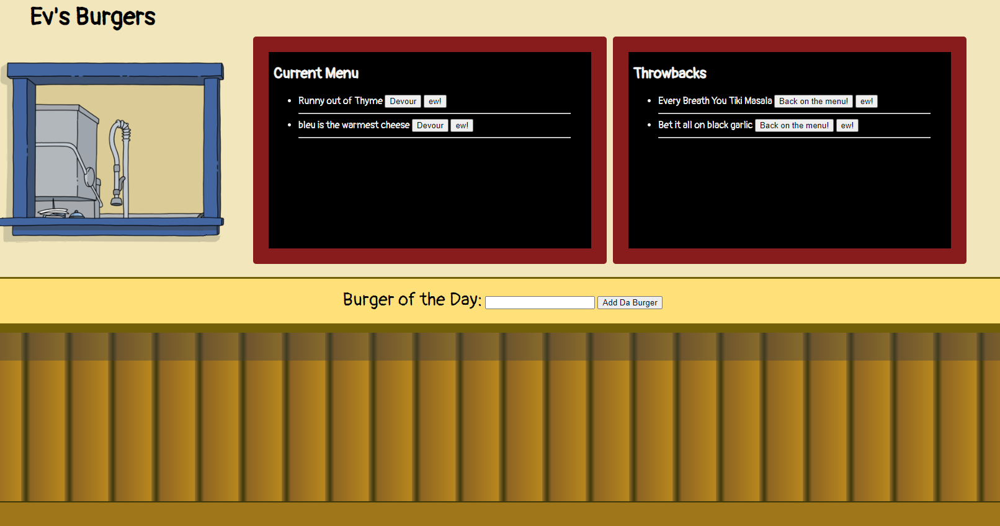

# EvsBurgers

  |      Table of Contents:       |
  |-------------------------------|
  | [Installation](#installation) |
  |        [Usage](#usage)        |
  | [Contributing](#contributing) |
  |     [Tests](#tests)           |
  |    [Questions](#questions)    |
  |    [Credits](#credits)        |
  |     [License](#license)       |
  
  ## Description
  
 A fullstack 'burger place' app that utilizes node, express, mysql, handlebars, and the MVC model including an orm. Persistent data by way of heroku hosting and jawsDB database handling.
  
  ## Installation
  
 While this app is fully functional via the hosted link [EvsBurgers](https://pure-spire-01384.herokuapp.com/), any development on this app depends heavily on the [mysql](https://www.npmjs.com/package/mysql), [express](https://www.npmjs.com/package/express) and [express-handlebars](https://www.npmjs.com/package/express-handlebars), and should only be attempted after successful completion of the installations of the aforementioned node modules.
  
  
  ## Usage 
  

  This app sends routed frontend requests to the server via the MVC model.  The user is able to click on buttons next to the stored burger items from the main and past menus, add burgers for eatin', and delete menu items from either menu with an additional "ew" button. 

  
  
  
  ## Contributing:
   
 Guidelines for contribution (if any): 

   Feel free to contribute as you see fit, see installation guidelines.  
  
  
  ## Tests:
  Command for running tests for this app:
  
 n/a
  
  
  ## Questions:
  [epachols's Github](https://github.com/epachols/)
  
  
  ## Credits:
   Collaborating Credits:
  
 none
  
  ## License information:
  
 
  CC0  [License Document](https://creativecommons.org/publicdomain/zero/1.0/)
  
  [https://choosealicense.com/](https://choosealicense.com/)
  
  ---
  
  |Thank you!         |
  --------------------
  |🏆 &#x1F981; epachols &#x1F981; 🏆|
  